# Architecture Overview

> Last updated: 2026-04-30 by `/sixees-workflow:architect`

`mcp-curl` is a security-hardened Model Context Protocol (MCP) server, written in TypeScript, that lets LLM clients perform HTTP requests by spawning a sandboxed `curl` binary. It exposes two built-in MCP tools (`curl_execute`, `jq_query`) plus an extension surface (`McpCurlServer` builder, hooks, custom tools, YAML-driven schema-generated tools) and supports both `stdio` and HTTP (Streamable + SSE) transports. The architecture is layered: pure config predicates → stateful security functions → tool handlers, composed through a fluent builder rather than inheritance.

## Stack & Distribution

Node ≥18 ESM, TypeScript strict, Zod runtime validation, `@modelcontextprotocol/sdk` 1.x, Express for HTTP transport, `js-yaml` for schema loading, vitest for tests, tsup for bundling. See `package.json` for pinned versions.

- **Distribution.** Published to npm as `mcp-curl`; see `package.json` for the current version rather than a number copied here. `prepublishOnly` runs the tsup build; only `dist/` and `docs/` are shipped.
- **CI/CD.** No `.github/workflows/` checked in. Quality gates rely on local `npm test` plus `.coderabbit.yaml` and `.gemini/styleguide.md` for external review.
- **Deployment surfaces.** Three modes — global CLI (`bin: curl-mcp`), library import, HTTP server behind a process manager (`TRANSPORT=http PORT=… npm start`).

### Public Surface (build outputs)

`tsup.config.ts` builds four entries with `splitting: true` and externalises peers (`zod`, `@modelcontextprotocol/sdk`, `express`, `js-yaml`) so consumers reuse a single instance — important for type identity of Zod schemas and SDK objects.

| `package.json:exports` | Source | Purpose |
|---|---|---|
| `.` (default) | `src/lib.ts` | Library — `McpCurlServer`, `createApiServer`, public types |
| `./cli` | `src/index.ts` | The `curl-mcp` binary |
| `./lib` | `src/lib/index.ts` | Internal lib re-export (advanced use) |
| `./schema` | `src/lib/schema/index.ts` | Schema-only subset (loader, validator, generator, types) |

## Directory Structure

Code is organised by layer in `src/lib/` — see `CLAUDE.md` for the canonical module map. The architectural rule is the **purity boundary**: `config/security/*` is frozen pure data + predicates; `security/*` is the stateful counterpart that imports those predicates and adds DNS lookups, rate-limit maps, and throttle state. Tests are co-located as `*.test.ts`; each folder has an `index.ts` barrel.

> **Layering wrinkle:** `utils/sanitize.ts` hosts `INJECTION_PATTERNS` (the prompt-injection detection regex) and `applySpotlighting` (sentinel wrapping). Detection lives in `utils/`, deliberately outside the `security/` layer, because it is a pure transform invoked from both `response/processor.ts` and `tools/jq-query.ts`. Anyone tracing the security model needs to read three places: `config/security/`, `security/`, and `utils/sanitize.ts`.

## Runtime Objects

This is not a CRUD application. The "domain" is request mediation; entities are runtime constructs, not persisted records.

| Entity | Where it lives | Notes |
|---|---|---|
| `CurlRequest` | `CurlExecuteInput` (`server/schemas.ts:10`) | Zod-validated tool input |
| `DnsResolution` | `security/ssrf.ts` | `{ hostname, port, resolvedIp }`; pinned via `--resolve` |
| `CurlInvocation` | `execution/command-executor.ts` | Spawned process with allowlist + AbortController timeout |
| `Response` | `response/parser.ts`, `processor.ts` | Body extracted via per-request UUID metadata separator |
| `SavedFile` | `response/file-saver.ts` | `mode 0o600`, filename `safeBase + _<ts>.txt` |
| `JqFilter` | `jq/parser.ts`, `jq/filter.ts` | Bounded subset — ≤20 paths, 100 ms parse timeout |
| `Session` | `session/session-manager.ts` | HTTP only; UUID-keyed; 1 h idle timeout |
| `RateLimitEntry` | `security/rate-limiter.ts` | Two `Map`s — per-host + per-client |
| `Hook` | `extensible/hook-executor.ts` | `beforeRequest` / `afterResponse` / `onError` |
| `ApiSchema` / `EndpointTool` | `schema/loader.ts`, `generator.ts` | YAML → Zod input schema → curl-delegating handler |

### Key Workflows

1. **`curl_execute`** — Zod parse → cross-field validation → URL parse + DNS resolve + SSRF check → per-host & per-client rate limit → output-dir validate → unique metadata separator → `buildCurlArgs` (with `--resolve`, `--proto`, `--max-filesize`) → `spawn("curl", …)` no-shell → streamed buffer (memory tracked) → metadata split (yields `%{size_header}`) → header/body split at that offset (when `include_headers`) → `defendText` on each of body and header text → optional jq → inline-vs-save decision → MCP `text` result.
2. **`jq_query`** — Path validation (`realpath`, allowed-roots check, traversal reject) → read file → tokenize → time-boxed parse → walk → sanitize + injection-detect → inline-vs-save.
3. **Hook lifecycle (built-in tools only).** `beforeRequest` (sequential, may short-circuit or merge params) → tool body → on success `afterResponse`, on throw `onError`. **Custom tools and schema-generated tools both bypass this wrapper** — see Workflow #4. All hooks run with a frozen config snapshot.
4. **YAML → tools.** `loadApiSchema()` (safe `JSON_SCHEMA`, no `!!js/function`) → `validateApiSchema` → `generateToolDefinitions` produces handlers that close over `executeCurlRequest` directly. `api-server.ts` then registers each via `server.registerCustomTool(…)`, **so schema-generated tools bypass `executeWithHooks` in the same way custom tools do.** SSRF, rate limit, sanitize, and injection-detect defenses still apply because they live inside `executeCurlRequest`, not in the hook layer. Operators relying on hooks for observability of *all* tool traffic must wrap their schema/custom handlers themselves.
5. **HTTP session lifecycle.** `POST /mcp` with no session id → enforce `MAX_SESSIONS=100` → new `McpServer` + `StreamableHTTPServerTransport(randomUUID)` → store with `lastActivity` → idle reaper (`setInterval`, `unref`) closes sessions older than 1 h; client disconnect or `DELETE /mcp` reaps explicitly.

### Business Rules / Invariants

> **The numbered, citable invariant list lives in `ARCHITECTURE.md` at the repository
> root** — that is the copy a review finding or an RC cites by number, and the copy to
> change. The bullets below are the operational rules of this system stated in prose;
> where the two describe the same property, the numbered list is authoritative. Do not
> add a new invariant here without adding it there, or the two will diverge — they did
> once already, and the divergence was found by review rather than by anyone reading
> both.

- URL must parse, use `http`/`https`, and resolve to a non-private IP before the request issues (unless `MCP_CURL_ALLOW_LOCALHOST=true`).
- cURL is pinned to the resolved IP via `--resolve hostname:port:ip` — defeats DNS rebinding.
- `include_headers` reports the header block separately from the body, so it composes
  with `jq_filter` and `save_to_file`; a saved file holds the body only. Header text is
  server-controlled and takes the **full** defence pipeline (`processor.ts::defendText` —
  sanitise, detect, and the markup/markdown strip stages), not sanitise-and-detect alone;
  it is capped at `LIMITS.MAX_HEADER_TEXT_BYTES` because it is surfaced inline even when
  the body was saved. The header/body boundary comes from cURL's `%{size_header}` on the
  `-w` metadata channel, never from pattern-matching the response bytes. See
  `ARCHITECTURE.md` invariants 1a, 13 and 14.
- Both per-host (60/min) **and** per-client (300/min) rate limits apply.
- `jq_query` reads are confined to `{ tempDir, MCP_CURL_OUTPUT_DIR, cwd-subtree }` after `realpath()` resolution.
- Responses larger than `max_result_size` (default 500 KB, max 1 MB) auto-save to a `0o600` file.
- Custom tool names match `^[a-z][a-z0-9_]*$`; `curl_execute` and `jq_query` are reserved.
- Config and hooks are frozen at `start()`; subsequent mutators throw.

## Data Flow

This service has no database, no message queue, and no external cache. All state is process-local; only saved responses and the temp directory hit the filesystem.

### Request Lifecycle (`curl_execute`)

```mermaid
flowchart LR
    A[MCP transport] --> B[Zod CurlExecuteSchema]
    B --> C[executeCurlRequest]
    C --> D[SSRF + DNS resolve]
    D --> E[Rate limit checks]
    E --> F[Output dir validate]
    F --> G[buildCurlArgs<br/>--resolve --proto --max-filesize]
    G --> H[spawn 'curl' no-shell<br/>AbortController timeout]
    H --> I[stdout stream<br/>allocateMemory per chunk]
    I --> J[parseResponseWithMetadata]
    J --> K[sanitize + injection-detect]
    K --> L{jq_filter?}
    L -- yes --> M[JSON.parse + applyJqFilter<br/>+ re-sanitize/detect]
    L -- no --> N{size > max_result_size<br/>or save_to_file?}
    M --> N
    N -- yes --> O[saveResponseToFile<br/>mode 0o600]
    N -- no --> P[inline content]
    O --> Q[formatResponse]
    P --> Q
    Q --> S[afterResponse hooks]
    S --> T[maybeApplySpotlighting<br/>if enableSpotlighting]
    T --> R[MCP text result]
    S -. throws .-> U[onError hooks]
    U -. rethrow original .-> R
```



Stage notes:

- **SSRF + DNS** — `validateUrlAndResolveDns` runs `dns.lookup`, validates the resolved IP against frozen blocklists, and returns `{ hostname, port, resolvedIp }` (`security/ssrf.ts`).
- **Memory tracker** — module-level counter `totalResponseMemory`, capped at `LIMITS.MAX_TOTAL_RESPONSE_MEMORY = 100 MB`. Per-chunk `allocateMemory` kills the child if either the global cap or `MAX_RESPONSE_SIZE = 10 MB` per request would be exceeded (`execution/memory-tracker.ts`, `execution/command-executor.ts`).
- **Metadata separator** — per-request `\n---MCP-CURL-${randomUUID()}---\n` injected via cURL `-w`, used to split body from `%{content_type}` (`types/common.ts`, `response/parser.ts`).
- **Sanitize + detect** — strips C0/C1, zero-width, bidi, BOM, U+2028/2029, Tags-block; runs combined injection regex; logs throttled per host. Sanitization is **observability-only** — content is never suppressed.
- **afterResponse + spotlighting** — `tool-wrapper.ts` invokes `executeWithHooks` (which runs `afterResponse` synchronously and routes its throws to `onError`) and then `maybeApplySpotlighting`, which wraps the text in per-request UUID sentinels when `config.enableSpotlighting === true`. Schema-generated and custom tools skip this tail — they go straight from handler return to MCP result.

### Data Stores

| Store | Type | What it holds | Access pattern |
|---|---|---|---|
| `SessionManager.sessions` | In-memory `Map<string, Session>` | HTTP transports + per-session `McpServer` + `lastActivity` | Created on `POST /mcp`, idle-reaped at 1 h |
| Rate limiter | Two `Map`s (host, client) | Fixed-window counters | Created in handler, swept every 10 s |
| Memory tracker | Module-level counter | Bytes accumulated across in-flight requests | Per-chunk `allocate` / `release` |
| Injection-detect throttle | `Map<host, lastTs>` | Per-host last-logged time | 60 s window, swept on interval |
| Allowed-dirs cache | TTL'd map | Resolved cwd / output-dir paths | 60 s TTL (`config/jq.ts`) |
| Temp dir | Filesystem | Saved responses | `mkdtemp` with `chmod 0o700`; files `0o600` |
| `MCP_CURL_OUTPUT_DIR` / cwd | Filesystem | Operator-controlled save target | Read-validated for `jq_query` |

### External Integrations

| Service | Protocol | Purpose | Auth method |
|---|---|---|---|
| `curl` binary | `spawn` (no shell) | The actual HTTP request | None (executed locally) |
| Node `dns` | Library | SSRF pre-flight resolution | None |
| MCP client | JSON-RPC over stdio or Streamable HTTP/SSE | Tool/resource/prompt invocation | Optional bearer token (HTTP) |
| Operator-supplied API (via YAML) | HTTP via `executeCurlRequest` | Schema-generated endpoint tools | Per-schema env vars (e.g., `apiKey.envVar`) |

## Security Architecture

Security is the central concern. Controls layer in depth, but the document deliberately calls out the residual risks an operator must accept.

### Threat Model

The **LLM client and any process with network reach to the bind interface are implicitly trusted.** The hardening below assumes this — it does not protect against a malicious LLM that knows what it is doing, only against opportunistic prompt injection and accidental misuse.

Default deployment posture (HTTP transport, `MCP_AUTH_TOKEN` unset): any process on the host (or any LAN host if the operator overrides `MCP_CURL_HOST=0.0.0.0`) can `POST /mcp` with no authentication and no Origin header, and execute arbitrary http(s) requests subject to the SSRF allowlist. The browser-origin attack surface is partly mitigated by `DEFAULT_HOST = "127.0.0.1"`, but operators running on shared workstations or with public bindings **must** set `MCP_AUTH_TOKEN`.

### Network / SSRF Defense — strategy

DNS-resolve-then-pin: validate the URL, resolve via Node's `dns.lookup`, check the resolved IP against frozen blocklists (private + cloud-metadata + DNS-rebinding services + internal TLDs), then pass `--resolve hostname:port:ip` to cURL so it cannot re-resolve to a different IP. Triple protocol enforcement: Zod refinement, URL parser refusal in SSRF, and cURL `--proto =http,https` + `--proto-redir =http,https` for redirects. Localhost is blocked unless `MCP_CURL_ALLOW_LOCALHOST` is set, and even then to ports 80, 443, or `>1024`. Windows UNC paths rejected at the URL string and as a hostname pattern. `--max-filesize 10 MB` is the early server-side abort; per-chunk Node-level kill is the streaming backstop.

For exact blocklists — CIDRs, hostnames, TLDs, rebinding services — see `src/lib/config/security/ssrf.ts:62-153`.

### Rate Limiting

Two fixed-window counters (per-host, per-client) — `security/rate-limiter.ts`. Limits: 60/min per host, 300/min per client; both must pass. Cleanup `setInterval` runs every 10 s (`unref`'d). For stdio, client id is the constant `__stdio_client__`; for HTTP, it is the validated session id.

**Boundary burst is exploitable today.** The window resets unconditionally when `(now - windowStart) >= WINDOW_MS` (`rate-limiter.ts:46-50`), so up to 2× the nominal limit can pass in a 1–2 second crossing — 120 requests per host, 600 per client, each a possible 10 MB pull (~1.2 GB of amplified DoS in seconds). Treat the limits as soft when serving untrusted clients (HTTP unauthed, shared stdio).

### Authentication & Authorization

- **Authentication (HTTP only).** Optional bearer token via `MCP_AUTH_TOKEN`. When unset, **all HTTP requests pass** — backwards-compatible default. When set, `safeStringCompare` (`security/input-validation.ts:17-32`) length-pads both buffers, calls `crypto.timingSafeEqual`, and AND-s an explicit length-equality bit so unequal lengths still consume constant time.
- **Authorization.** None. There is no role/permission model. Access control is binary at the transport boundary (auth token or none).
- **Origin allowlist.** `createOriginMiddleware` (`transports/http.ts`) defends against browser-origin abuse. **Missing-`Origin` requests pass through** unconditionally (line 71-75) to support CLI clients — combined with no-bearer default, this is the threat-model's worst case. A page issuing `fetch` with `mode: 'no-cors'` and no Origin header (or a non-fetch transport) reaches `POST /mcp` directly; only the bind-interface and SSRF allowlist stand in the way.

### Input Validation

- Zod schemas (`server/schemas.ts`) — `url` http/https refine, `max_redirects 0–50`, `timeout 1–300 s`, `max_result_size 1 KB–1 MB`.
- **Command allowlist** — `ALLOWED_COMMANDS = ["curl"] as const` checked at compile time and runtime.
- **`spawn()` without shell** — argv array; **shell-level command injection is structurally impossible.**
- **Flag injection.** Header names accept any non-CR/LF/NUL string (Zod `z.record(z.string(), z.string())`); only `validateNoCRLF` filters CR/LF/NUL. Flag injection is prevented by argv ordering (``args.push("-H", `${key}: ${value}`)``) — every future builder edit must preserve this. Header names are not constrained to RFC 7230 `tchar`, so malformed names with whitespace or `:` may produce inconsistent behavior at downstream proxies.
- **CRLF prevention** — `validateNoCRLF` rejects `\r`, `\n`, `\0` in header names/values, form fields, user agent, basic-auth, bearer token.
- **`@`-file exfil prevention** — bodies use `--data-raw`, forms use `--form-string` so cURL never reads from `@filename`.
- **Per-request metadata separator** — random UUID prevents response-content collision attacks against the `-w` boundary; tail-only `lastIndexOf` window adds defense in depth.

### File Access (`jq_query`)

- Allowed roots: shared temp dir, `MCP_CURL_OUTPUT_DIR`, `process.cwd()` and **all subdirs**.
- All paths run through `realpath()` (input + each allowed root) before the containment check.
- `relative()`-based check rejects `..` traversal and absolute escapes.
- Allowed-dirs cache TTL 60 s (`config/jq.ts:17`); temp dir is re-resolved every call.
- 10 MB ceiling per file (`JQ.MAX_QUERY_FILE_SIZE`).

> **Operator warning.** Launch the server from a dedicated working directory containing **no secrets, source trees, SSH keys, or cloud credentials.** The cwd-and-subtree allowlist is intentionally broad to support iterative `jq_query` workflows; treat any file beneath cwd as readable by the LLM. A prompt-injected LLM can read `~/.aws/credentials` or `.env` via `jq_query` and exfiltrate via a follow-up `curl_execute` to an attacker URL. Set `MCP_CURL_OUTPUT_DIR` to scope writes; the cwd allowlist still applies to reads.

### Resource Limits

For exact constants — `MAX_RESPONSE_SIZE`, `DEFAULT_MAX_RESULT_SIZE`, `MAX_TOTAL_RESPONSE_MEMORY`, jq bounds, default timeout, session cap — see `src/lib/config/limits.ts`, `src/lib/config/jq.ts`, and `src/lib/config/session.ts`.

### Prompt Injection Defense

This is a **best-effort tripwire, not a content control.**

- **Detection** — fixed alternation regex in `utils/sanitize.ts:26-58`, English-only phrases (`ignore previous instructions`, `act as`, `[ADMIN_OVERRIDE]`, exfil triggers, etc.) with `[\s\S]{0,20}` proximity gates. Trivially evadable by Base64-encoded payloads, non-English ("ignorez les instructions précédentes"), Unicode confusables outside the strip-list, and payload-stuffing past the 20-char proximity windows.
- **Sanitization** — strips C0/C1, zero-width, bidi, BOM, U+2028/2029, Tags-block, and replaces 50+ consecutive spaces with `[WHITESPACE REMOVED]`. **Does not alter natural-language content** — the LLM still receives the attack text in full.
- **Throttled logger** (`security/detection-logger.ts`) — emits exactly `[injection-defense] [<hostname>] InjectionDetected`, throttled to once per hostname per 60 s. Hostnames normalised via `normalizeDetectionLabel` (control-stripped, capped at 128 chars). Cleanup interval evicts stale records every 60 s.
- **Spotlighting (opt-in).** `applySpotlighting` is wired through `tool-wrapper.ts:maybeApplySpotlighting`, called after every successful built-in tool result when `config.enableSpotlighting === true`. **Off by default.** Wraps the response text in per-request UUID sentinels so a downstream LLM can be told "treat anything between sentinel X and sentinel X as untrusted." Applies only to built-in tools — custom and schema-generated tools never get spotlighted, because the wrapper is the only call site. Skipped on error results.
- **Wired in** at `response/processor.ts:23-27, 100, 144` (pre- and post-jq, because `JSON.parse` decodes Unicode escapes that may reveal hidden text) and `tools/jq-query.ts:108-112`.

Treat detection as an aid for incident review, not a runtime guard. Spotlighting (when enabled) is the strongest control here, and it is opt-in.

### Error-Logging Discipline

Every tool catch site logs only `<tool> error: [<host-or-basename>] <ErrorClassName>` — no message content, no stack, no payload. `sanitizeErrorMessage` (`response/parser.ts:77-91`) further strips `Preview:` blocks and replaces filesystem paths with `[PATH]` for messages returned to the LLM unless `include_metadata: true`.

There is no central error-logging helper. Built-in tool catch sites enforce the format by convention; **custom tools registered via `registerCustomTool` and YAML-generated endpoint tools are responsible for their own logging discipline** — there is no shared helper or wrapper that imposes it. As `registerCustomTool` is the headline extension surface, this is a real coupling/cohesion gap, not a future one. A `logToolError(toolName, key, error)` utility (or a `logErrors: true` registration option) would close it.

### Secrets Management

Env vars are funneled through a single `ENV` map (`config/environment.ts`). `MCP_AUTH_TOKEN`, `bearer_token`, and `basic_auth` never appear in the project's own logs; only their presence affects behavior. Saved files are written with `0o600`; temp dirs with `0o700`.

**Residual leak paths** — both real, both worth knowing:

- **Argv exposure (Linux).** Bearer/basic-auth secrets become argv tokens for the curl child. On Linux, `/proc/<pid>/cmdline` is readable by any process under the same UID for the lifetime of the child. Avoid running the server alongside untrusted local processes.
- **Verbose flag stderr trap.** `verbose: true` opts the request into curl's stderr trace, which includes the `Authorization:` header value verbatim. The executor captures stderr and surfaces it. Treat `verbose` as a debug-only flag and never set it on requests carrying secrets.

## Code Patterns & Conventions

### Architecture Patterns

- **Layered, with a hard purity boundary** — `config/security/*` is pure data + frozen predicates; `security/*` is the stateful counterpart. The directory boundary is the only enforcement.
- **Fluent builder** — `McpCurlServer` returns `this` from every configurator; freezes its config + hooks at `start()` to make the running server immutable.
- **Composition over inheritance** — no `extends` chains; `McpCurlServer` composes `SessionManager`, `Hooks`, `InstanceUtilities`.
- **Factory functions** — `createServer`, `createApiServer`, `createInstanceUtilities`, `createHttpApp`, `loadApiSchema`.
- **Strategy / dependency injection** — `executeWithHooks(ctx, executor)` accepts the tool body as a parameter; tool registration takes an options object `{ executor, enabled, config, hooks }`.
- **Schema-first** — Zod schemas drive both runtime validation and TypeScript types; `as const` literal unions yield exhaustiveness checks.

### Naming Conventions

| Element | Convention | Example |
|---|---|---|
| Files | kebab-case | `mcp-curl-server.ts`, `curl-args-builder.ts` |
| Test files | mirror source + `.test.ts` | `ssrf.ts` ↔ `ssrf.test.ts` |
| Classes | PascalCase | `McpCurlServer`, `SessionManager` |
| Functions | camelCase verb | `executeCommand`, `validateUrlAndResolveDns` |
| Types/Interfaces | PascalCase noun (no `I` prefix) | `CurlExecuteResult`, `Hooks` |
| Module constants | `SCREAMING_SNAKE` `as const` | `LIMITS`, `ENV`, `ALLOWED_COMMANDS` |
| Private class members | leading underscore | `_config`, `_hooks`, `_started` |
| MCP tool names | snake_case | `curl_execute`, `jq_query` |
| Schema fields | snake_case (matches cURL CLI) | `follow_redirects`, `max_redirects`, `bearer_token` |

### Common Abstractions

- **Centralised Zod schemas** in `server/schemas.ts` with `.describe()` on every field — feeds both validation and tool documentation.
- **Hook executor** generic over `T extends CurlExecuteInput | JqQueryInput`.
- **Tool wrappers** `registerCurlToolWithHooks` / `registerJqToolWithHooks` keep built-in tools hook-aware while custom and schema-generated tools stay raw.
- **Sanitization helpers** `sanitizeDescription`, `sanitizeResponse`, `detectInjectionPattern`, `applySpotlighting` (`utils/sanitize.ts`).
- **Pure security predicates** `isBlockedIp`, `isBlockedHostname`, `isLocalhostIp`, `isAllowedLocalhostPort`.
- **Compile-time exhaustiveness** — `type _AssertExhaustive = [Exclude<keyof McpCurlConfig, …>] extends [never] ? true : never;` (`extensible/mcp-curl-server.ts`).

### Error Handling

Plain `Error` thrown everywhere — no custom subclasses, no `Result<T, E>`. Helpers in `utils/error.ts` produce consistent messages: `getErrorMessage(unknown)`, `createValidationError`, `createAccessError`, `createFileError`, `createConfigError`. Errors thrown deep in the stack are caught at the **tool handler boundary**, converted to `{ content, isError: true }`, and logged. Hook errors during `afterResponse` flow to `onError`; errors *inside* `onError` are suppressed with a name-only warning to preserve the original error's context.

### Logging

`console.error` only (stderr) — required because stdio reserves stdout for MCP framing. Format is structured by convention: `<tool> error: [<key>] <ErrorClassName>` and `[injection-defense] [<host>] InjectionDetected`. Throttling is per-host with a `Map`. Lifecycle warnings prefix `Warning:`. **Never** log message content.

### Testing Strategy

| Type | Framework | Location | Run command |
|---|---|---|---|
| Unit + integration | vitest | `src/**/*.test.ts` (co-located) | `npm test` |
| Watch | vitest | same | `npm run test:watch` |
| Out-of-tree integration | Node script | `scripts/integration-test.mjs` | invoked manually |

Vitest is configured with `globals: true`, `environment: 'node'`. There is no separate e2e harness; the integration script and example projects under `examples/` provide end-to-end exercise.

## Development Workflow

### Build & Run

```bash
npm install                              # Install dependencies
npm run dev                              # tsup watch mode
npm run build                            # tsup + chmod 0755 on dist/index.js
npm test                                 # vitest run
npm start                                # node dist/index.js (stdio transport)
TRANSPORT=http PORT=3000 npm start       # HTTP transport on :3000 (binds 127.0.0.1 by default)
```

### Environment Setup

| Variable | Purpose | Default |
|---|---|---|
| `TRANSPORT` | `stdio` or `http` (case-insensitive) | `stdio` |
| `PORT` | HTTP transport port | as set by transport |
| `MCP_CURL_HOST` | HTTP bind interface | `127.0.0.1` |
| `MCP_AUTH_TOKEN` | HTTP bearer token | unset (auth disabled — see Threat Model) |
| `MCP_CURL_ALLOWED_ORIGINS` | Origin allowlist (HTTP) | localhost regex set |
| `MCP_CURL_ALLOW_LOCALHOST` | Permit `127.0.0.0/8` targets | unset (blocked) |
| `MCP_CURL_OUTPUT_DIR` | Saved-response directory + `jq_query` read scope. **See File Access operator warning.** | unset (uses temp dir) |
| `MCP_CURL_USER_AGENT` | Default User-Agent | browser-like |
| `MCP_CURL_REFERER` | Default Referer | unset |

No external services need to be running. The server is a single Node process; the only required dependency outside the npm install is the `curl` binary on `PATH`.

## Architecture Decisions

| Decision | Rationale |
|---|---|
| Spawn `curl` (not `fetch`) | Battle-tested HTTP semantics, native `--max-filesize` early abort, `--resolve` IP pinning, `--proto` whitelist enforcement; isolates HTTP parsing complexity outside the Node process. |
| `spawn()` without shell + compile-time allowlist | Eliminates **shell-level** command injection. cURL flag injection is structurally prevented by argv ordering in `buildCurlArgs`, not by header-name validation. |
| Pure config / stateful split (`config/security` vs `security`) | Keeps blocklists immutable and trivially auditable; lets stateful code be tested in isolation against frozen inputs. |
| Fluent builder + freeze-on-start | Configuration is mutable until `start()`, immutable thereafter — predictable runtime, easier reasoning about hooks. |
| Per-request UUID metadata separator | Defends against response-content collisions in the cURL `-w` boundary; tail-only search adds defense in depth. |
| DNS resolve + `--resolve` pinning | Eliminates the TOCTOU window between Node validation and cURL's own DNS lookup, defeating rebinding. |
| Sanitize / detect, never suppress | Observability over censorship — the LLM still sees the raw content, the operator sees a throttled log. |
| Bearer auth opt-in (HTTP) | When `MCP_AUTH_TOKEN` is unset, all HTTP requests pass. Deliberate trade-off for backwards compatibility and CLI use cases — operators on shared hosts must set the token. See Threat Model. |
| Two MCP tools + extension surface | `curl_execute` and `jq_query` cover most cases; YAML schema and custom tools handle the rest without forking. |

## Known Constraints & Tech Debt

- **Cloud metadata coverage is implicit for some clouds.** Alibaba, Oracle, IBM metadata is caught by the `169.254.169.254` IP block, not by hostname. Operators reading the blocklist may not realise this.
- **`cwd` allowlist for `jq_query` is broad** — covers all subdirectories. Operator deployment guidance lives in §Security › File Access; the breadth is unlikely to change without breaking iterative workflows.
- **No central error-logging helper.** As `registerCustomTool` is the extension API, the lack of a shared `logToolError` helper means custom-tool authors must reinvent the format. Real coupling gap, not a future one.
- **Fixed-buffer streaming.** Bodies are concatenated into a single string before parsing. The 10 MB / 100 MB caps make this safe, but truly streaming consumers cannot incrementally process responses.
- **Two-directory purity boundary may be overkill.** The `config/security/*` ↔ `security/*` split exists to keep ~200 lines of frozen data separate from stateful code. A single `security/blocklists.ts` + sibling stateful modules would deliver the same auditability with fewer barrels and one less concept to explain. Reconsider before next major version.
- **YAML schema generator may be premature generalization.** `schema/{loader,validator,generator,types}.ts` plus `createApiServer` exists to convert YAML to tool definitions, but `.registerCustomTool()` already handles this in user code. The only consumer shown is `examples/from-yaml/`. Audit real-world consumers; if there are none, the schema folder and `createApiServer` factory could be retired in favour of a "load YAML in your own code, call `registerCustomTool`" example. ~400 lines and a public-API surface saved.
